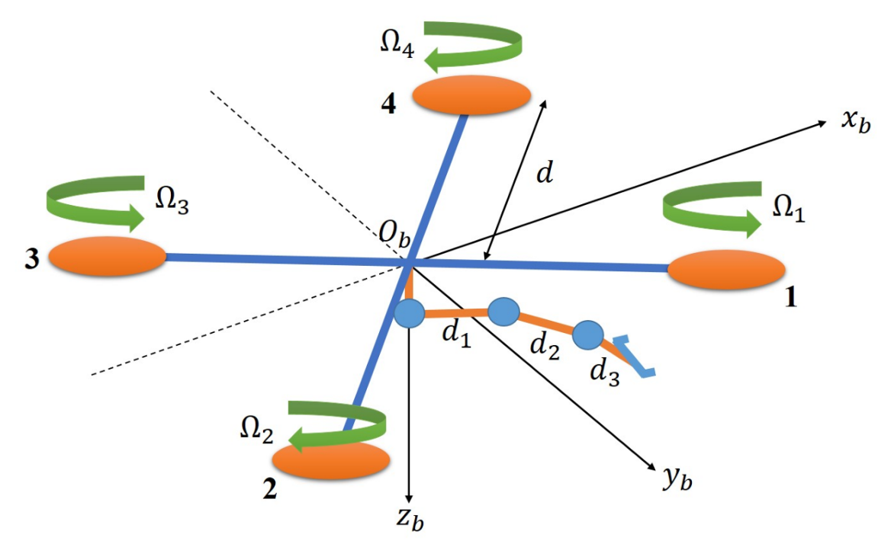

# Aerial-Manipulator-Simulation-Environment
This repository provides a Python-based simulation environment for a *3-link aerial manipulator*. 

The dynamic model of the system is developed and implemented based on the following research papers:

- S. Kim, H. Seo, S. Choi, and H. J. Kim, "Vision-Guided Aerial Manipulation Using a Multirotor With a Robotic Arm," IEEE/ASME Transactions on Mechatronics, vol. 21, no. 4, pp. 1912–1923, Aug. 2016. [doi:10.1109/TMECH.2016.2523602](doi:10.1109/TMECH.2016.2523602)

- S. A. Emami, A. Banazadeh, "Simultaneous trajectory tracking and aerial manipulation using a multi-stage model predictive control," Aerospace Science and Technology, vol. 112, 2021, article 106573. [doi:10.1016/j.ast.2021.106573](doi:10.1016/j.ast.2021.106573)

## Implementation Files
This repository includes the following Python scripts:

- `get_Gq.py`, `get_Cq.py`, `get_Mq.py`, `get_metrices.py`: implement the required system matrices for dynamics modeling based on the referenced papers.
- `parameters_Aerial_Manipulator.py`: script to configure and change system parameters.
- `AM_Env.py` — main simulation script for the environment that includes numerical integration, reset and step function implementation.
- `How_to_use.ipynb` — Jupyter notebook demonstrating how to import the environment, simulate various conditions and control inputs, and analyze the results.
